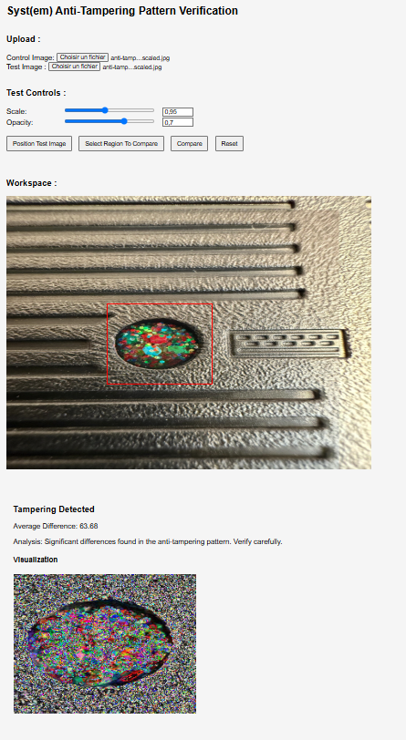

  

  

 A simple, single-file Python web app designed to easily compare two images that contain anti-tampering patterns. 

  

## Features
- Single-file Python web app
- Percentage and Visual results
- Easy to use

## Requirements
- Python 3+

## Demo

## Installation
- pip install -r requirements.txt
- python system_check.py